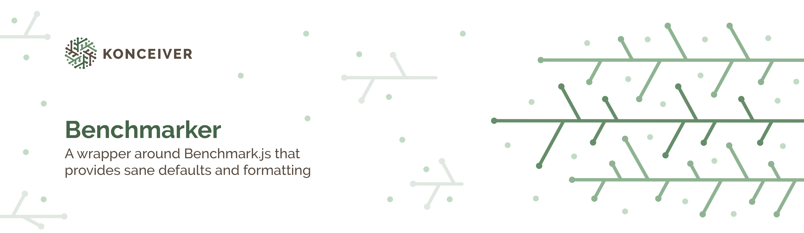

# @konceiver/benchmarker

<p align="center"></p>

[](https://www.npmjs.com/package/@konceiver/benchmarker)
[](./LICENSE)
[](https://img.shields.io/github/workflow/status/konceiver/benchmarker/CI?label=CI)
[](https://npmjs.org/package/@konceiver/benchmarker)

This package was created by, and is maintained by [Brian Faust](https://github.com/faustbrian), and provides a wrapper around Benchmark.js with sane defaults and formatting.

## Installation

```bash
yarn add @konceiver/benchmarker --dev
```

## Usage

```ts
import { benchmarker } from "@konceiver/benchmarker";

benchmarker("utils", [
	{
		name: "map",
		scenarios: require("./map"),
	},
	{
		name: "filter",
		scenarios: require("./filter"),
	},
	{
		name: "reduce",
		scenarios: require("./reduce"),
	},
]);
```

## Testing

```bash
yarn test
```

## Changelog

Please see [CHANGELOG](CHANGELOG.md) for more information on what has changed recently.

## Contributing

Please see [CONTRIBUTING](CONTRIBUTING.md) for details.

## Security

If you discover a security vulnerability within this package, please send an e-mail to security@konceiver.dev. All security vulnerabilities will be promptly addressed.

## Credits

This project exists thanks to all the people who [contribute](../../contributors).

## Support Us

We invest a lot of resources into creating and maintaining our packages. You can support us and the development through [GitHub Sponsors](https://github.com/sponsors/faustbrian).

## License

Benchmarker is an open-sourced software licensed under the [MIT](LICENSE.md).
